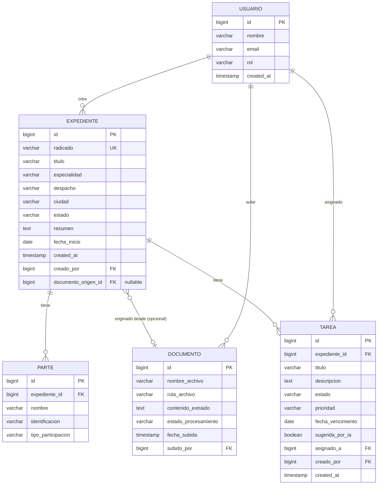

# Arquitectura — ExpedientIA

---

## 1. Modelo ER



### Enums

| Entidad | Campo | Valores |
|---|---|---|
| Usuario | rol | `ADMIN`, `ABOGADO`, `ASISTENTE` |
| Expediente | especialidad | `CIVIL`, `PENAL`, `LABORAL`, `ADMINISTRATIVO`, `FAMILIA` |
| Expediente | estado | `ACTIVO`, `CERRADO`, `ARCHIVADO` |
| Parte | tipo_participacion | `DEMANDANTE`, `DEMANDADO`, `APODERADO`, `TERCERO` |
| Documento | estado_procesamiento | `PENDIENTE`, `PROCESADO`, `ERROR` |
| Tarea | estado | `PENDIENTE`, `EN_PROGRESO`, `COMPLETADA` |
| Tarea | prioridad | `ALTA`, `MEDIA`, `BAJA` |

---

## 2. Backend — Spring Boot

### Estructura de carpetas

```
expedientia-backend/
├── src/main/java/com/expedientia/
│   ├── config/
│   │   └── AIConfig.java            # ChatClient bean de Spring AI
│   ├── controller/
│   │   ├── ExpedienteController.java
│   │   ├── DocumentoController.java
│   │   ├── TareaController.java
│   │   └── InformeController.java   # extra
│   ├── service/
│   │   ├── ExpedienteService.java
│   │   ├── DocumentoService.java
│   │   ├── TareaService.java
│   │   └── AIService.java           # toda la lógica de Spring AI
│   ├── repository/
│   │   ├── ExpedienteRepository.java
│   │   ├── DocumentoRepository.java
│   │   ├── TareaRepository.java
│   │   └── ParteRepository.java
│   ├── entity/
│   │   ├── Expediente.java
│   │   ├── Documento.java
│   │   ├── Tarea.java
│   │   ├── Parte.java
│   │   └── Usuario.java
│   ├── dto/
│   │   ├── ExpedienteDTO.java
│   │   ├── CreateExpedienteRequest.java
│   │   ├── DocumentoExtraidoDTO.java  # lo que devuelve Gemini al procesar
│   │   └── TareaDTO.java
│   └── exception/
│       ├── GlobalExceptionHandler.java
│       └── ResourceNotFoundException.java
├── src/main/resources/
│   └── application.properties
├── Dockerfile
└── docker-compose.yml
```

### Endpoints

| Método | Ruta | Descripción |
|---|---|---|
| `POST` | `/api/expedientes/chat` | Crear expediente desde prompt natural |
| `POST` | `/api/expedientes` | Crear expediente (con o sin documentoId) |
| `GET` | `/api/expedientes` | Listar expedientes |
| `GET` | `/api/expedientes/{id}` | Detalle de expediente |
| `PUT` | `/api/expedientes/{id}` | Editar expediente |
| `DELETE` | `/api/expedientes/{id}` | Eliminar expediente |
| `POST` | `/api/documentos/procesar` | Subir PDF → IA extrae campos → devuelve DocumentoExtraidoDTO |
| `GET` | `/api/expedientes/{id}/tareas` | Listar tareas del expediente |
| `POST` | `/api/expedientes/{id}/tareas` | Crear tarea |
| `PUT` | `/api/tareas/{id}` | Actualizar tarea |
| `DELETE` | `/api/tareas/{id}` | Eliminar tarea |
| `POST` | `/api/informes` | Generar informe (extra) |

### Docker

**`Dockerfile`**
```dockerfile
FROM eclipse-temurin:21-jdk-alpine
WORKDIR /app
COPY target/*.jar app.jar
EXPOSE 8080
ENTRYPOINT ["java", "-jar", "app.jar"]
```

**`docker-compose.yml`**
```yaml
services:
  db:
    image: postgres:17-alpine
    environment:
      POSTGRES_DB: expedientia
      POSTGRES_USER: expedientia
      POSTGRES_PASSWORD: expedientia
    ports:
      - "5432:5432"
    volumes:
      - postgres_data:/var/lib/postgresql/data

  backend:
    build: .
    ports:
      - "8080:8080"
    environment:
      SPRING_DATASOURCE_URL: jdbc:postgresql://db:5432/expedientia
      SPRING_DATASOURCE_USERNAME: expedientia
      SPRING_DATASOURCE_PASSWORD: expedientia
      SPRING_AI_GOOGLE_GEMINI_API_KEY: ${GEMINI_API_KEY}
    depends_on:
      - db

volumes:
  postgres_data:
```

---

## 3. Frontend — React + TypeScript

### Estructura de carpetas

```
expedientia-frontend/
├── src/
│   ├── routes/
│   │   ├── __root.tsx                  # layout global (sidebar + header)
│   │   ├── index.tsx                   # dashboard
│   │   ├── expedientes/
│   │   │   ├── index.tsx               # listado
│   │   │   ├── nuevo.tsx               # creación: tab chat | tab desde documento
│   │   │   └── $expedienteId/
│   │   │       └── index.tsx           # detalle
│   │   └── informes/
│   │       └── index.tsx               # extra
│   ├── components/
│   │   ├── chat/
│   │   │   ├── ChatInput.tsx
│   │   │   └── ChatMessage.tsx
│   │   ├── expediente/
│   │   │   ├── ExpedienteCard.tsx
│   │   │   ├── ExpedienteDetail.tsx
│   │   │   └── DocumentoUpload.tsx
│   │   ├── tarea/
│   │   │   ├── TareaItem.tsx
│   │   │   └── TareaList.tsx
│   │   └── ui/
│   │       ├── Button.tsx
│   │       ├── Badge.tsx
│   │       └── EmptyState.tsx
│   ├── hooks/
│   │   ├── useExpedientes.ts           # TanStack Query
│   │   ├── useExpediente.ts
│   │   ├── useTareas.ts
│   │   └── useDocumento.ts
│   ├── store/
│   │   └── chatStore.ts                # Zustand: historial de chat
│   ├── api/
│   │   ├── client.ts                   # axios instance
│   │   ├── expedientes.ts
│   │   ├── tareas.ts
│   │   └── documentos.ts
│   └── types/
│       └── index.ts                    # Zod schemas + tipos inferidos
```

### Estado global (Zustand)

Solo para estado de UI que no es servidor:

```ts
// chatStore.ts
interface ChatStore {
  messages: ChatMessage[]
  isLoading: boolean
  addMessage: (msg: ChatMessage) => void
  setLoading: (v: boolean) => void
  clear: () => void
}
```

Todo lo demás (expedientes, tareas, documentos) va en **TanStack Query** — no en Zustand.

---

## 4. Wireframes

### W1 — Dashboard

```
┌─────────────────────────────────────────────────────────────┐
│  ExpedientIA           [Expedientes] [Informes]    [Avatar] │
├──────────────────────────────────────────────────────────────┤
│                                                              │
│  Expedientes recientes              [+ Nuevo expediente]     │
│  ─────────────────────────────────────────────────────────  │
│  ┌──────────────────────────────────────────────────────┐   │
│  │ 🗂  2026-00412 — García vs. Municipio                 │   │
│  │    Laboral · Activo             3 tareas pendientes  │   │
│  └──────────────────────────────────────────────────────┘   │
│  ┌──────────────────────────────────────────────────────┐   │
│  │ 🗂  2026-00399 — Torres S.A.                          │   │
│  │    Laboral · Activo             1 tarea pendiente    │   │
│  └──────────────────────────────────────────────────────┘   │
│                                                              │
└─────────────────────────────────────────────────────────────┘
```

---

### W2 — Nuevo expediente (chat)

```
┌─────────────────────────────────────────────────────────────┐
│  ← Volver          Nuevo expediente                         │
├──────────────────────────────────────────────────────────────┤
│                                                              │
│  ┌──────────────────────────────────────────────────────┐   │
│  │                                                      │   │
│  │  🤖  Hola, describí el expediente y lo creo por vos. │   │
│  │      Podés incluir partes, radicado, juzgado, etc.   │   │
│  │                                                      │   │
│  │                                                      │   │
│  │  👤  Crear expediente penal contra Juan García,      │   │
│  │      radicado 2026-00412, juzgado 3 civil...         │   │
│  │                                                      │   │
│  │  🤖  Creando expediente...                           │   │
│  │      ✓ Radicado: 2026-00412                         │   │
│  │      ✓ Tipo: Penal                                  │   │
│  │      ✓ Partes identificadas: 2                      │   │
│  │      [Ver expediente creado →]                       │   │
│  │                                                      │   │
│  └──────────────────────────────────────────────────────┘   │
│                                                              │
│  ┌─────────────────────────────────────┐  [Enviar ↵]       │
│  │  Describí el expediente...          │                    │
│  └─────────────────────────────────────┘                    │
│                                                              │
└─────────────────────────────────────────────────────────────┘
```

---

### W3 — Detalle de expediente

```
┌─────────────────────────────────────────────────────────────┐
│  ← Volver    2026-00412 — García vs. Municipio  [Editar]    │
├──────────────────────────────────────────────────────────────┤
│                                                              │
│  ┌─────────────────────────┐  ┌───────────────────────────┐ │
│  │ Resumen IA              │  │ Datos del expediente       │ │
│  │ ─────────────────────   │  │ ────────────────────────  │ │
│  │ Proceso civil iniciado  │  │ Especialidad: Civil        │ │
│  │ por Juan García contra  │  │ Despacho: Juzgado 3        │ │
│  │ el Municipio de Bogotá  │  │ Ciudad:   Bogotá           │ │
│  │ por daños en propiedad. │  │ Estado:   Activo           │ │
│  └─────────────────────────┘  └───────────────────────────┘ │
│                                                              │
│  Tareas                                    [+ Nueva tarea]  │
│  ─────────────────────────────────────────────────────────  │
│  ☐  Radicar respuesta — ALTA — vence 25 may                 │
│  ☐  Revisar auto admisorio — MEDIA                          │
│  ✓  Crear expediente                                        │
│                                                              │
└─────────────────────────────────────────────────────────────┘
```

---

### W4 — Subir documento (extracción IA)

```
┌─────────────────────────────────────────────────────────────┐
│  Subir documento                                            │
├──────────────────────────────────────────────────────────────┤
│                                                              │
│  ┌──────────────────────────────────────────────────────┐   │
│  │                                                      │   │
│  │          📄  Arrastrá el PDF acá                     │   │
│  │              o  [Seleccionar archivo]                │   │
│  │                                                      │   │
│  └──────────────────────────────────────────────────────┘   │
│                                                              │
│  ── Después de subir ─────────────────────────────────────  │
│                                                              │
│  ✓ Documento procesado — auto-admisorio.pdf                 │
│                                                              │
│  Campos extraídos por IA:                                   │
│  ┌──────────────────────────────────────────────────────┐   │
│  │ Radicado        2026-00412              [editar]     │   │
│  │ Especialidad    Civil                   [editar]     │   │
│  │ Demandante      Juan García             [editar]     │   │
│  │ Demandado       Municipio de Bogotá     [editar]     │   │
│  │ Despacho        Juzgado 3 Civil         [editar]     │   │
│  └──────────────────────────────────────────────────────┘   │
│                                                              │
│  Tareas sugeridas:                                          │
│  ☐  Radicar respuesta al auto  [+ Agregar]                 │
│  ☐  Notificar a las partes     [+ Agregar]                 │
│                                                              │
│              [Crear expediente con estos datos]             │
│                                                              │
└─────────────────────────────────────────────────────────────┘
```
