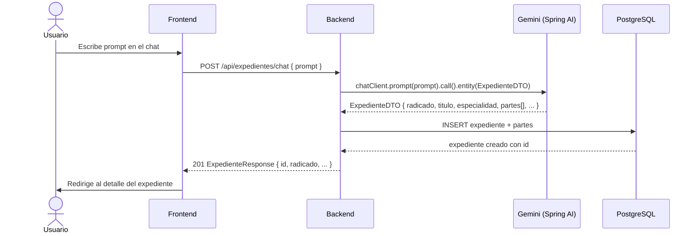
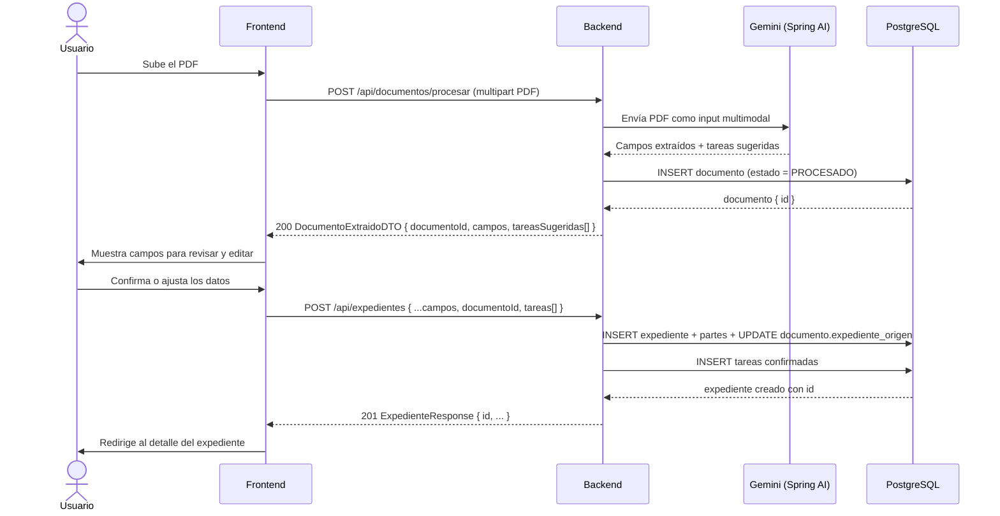
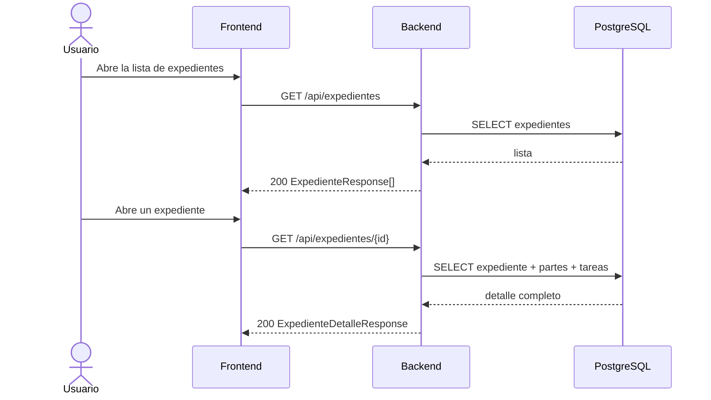
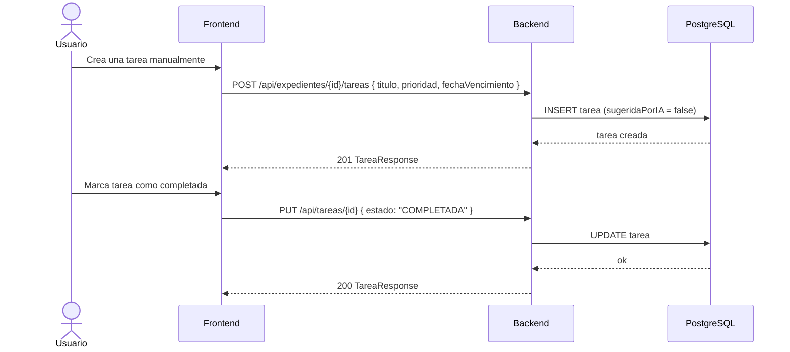
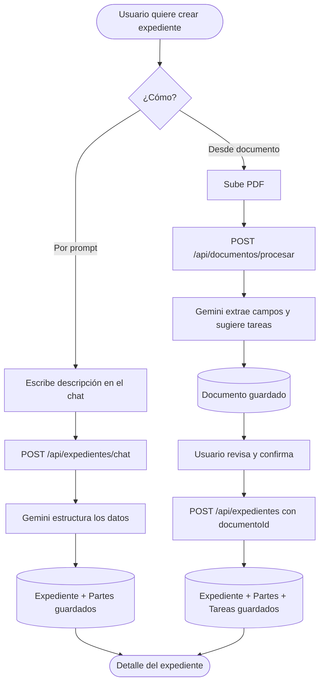

# Flujos y contratos de endpoints — ExpedientIA

---

## Flujo 1 — Crear expediente por chat



### POST /api/expedientes/chat

**Request**
```json
{
  "prompt": "Crear expediente penal contra Juan García, radicado 2026-00412, juzgado 3 civil del circuito de Bogotá"
}
```

**Response 201**
```json
{
  "id": 1,
  "radicado": "2026-00412",
  "titulo": "García vs. Municipio",
  "especialidad": "PENAL",
  "despacho": "Juzgado 3 Civil del Circuito",
  "ciudad": "Bogotá",
  "estado": "ACTIVO",
  "resumen": "Proceso penal iniciado contra Juan García...",
  "partes": [
    { "nombre": "Juan García", "tipoParticipacion": "DEMANDADO" }
  ],
  "createdAt": "2026-05-20T10:00:00"
}
```

---

## Flujo 2 — Crear expediente desde documento (flujo principal de la demo)



### POST /api/documentos/procesar

**Request** — `multipart/form-data`
```
file: [binary PDF]
```

**Response 200**
```json
{
  "documentoId": 7,
  "nombreArchivo": "auto-admisorio.pdf",
  "camposExtraidos": {
    "radicado": "2026-00412",
    "titulo": "García vs. Municipio de Bogotá",
    "especialidad": "CIVIL",
    "despacho": "Juzgado 3 Civil del Circuito",
    "ciudad": "Bogotá",
    "fechaInicio": "2026-05-15",
    "partes": [
      { "nombre": "Juan García", "identificacion": "1234567", "tipoParticipacion": "DEMANDANTE" },
      { "nombre": "Municipio de Bogotá", "identificacion": "8994567", "tipoParticipacion": "DEMANDADO" }
    ]
  },
  "tareasSugeridas": [
    { "titulo": "Radicar respuesta al auto", "prioridad": "ALTA" },
    { "titulo": "Notificar a las partes", "prioridad": "MEDIA" }
  ]
}
```

---

### POST /api/expedientes

Usado tanto para confirmar la extracción del documento como para crear manualmente.

**Request**
```json
{
  "radicado": "2026-00412",
  "titulo": "García vs. Municipio de Bogotá",
  "especialidad": "CIVIL",
  "despacho": "Juzgado 3 Civil del Circuito",
  "ciudad": "Bogotá",
  "fechaInicio": "2026-05-15",
  "partes": [
    { "nombre": "Juan García", "identificacion": "1234567", "tipoParticipacion": "DEMANDANTE" },
    { "nombre": "Municipio de Bogotá", "identificacion": "8994567", "tipoParticipacion": "DEMANDADO" }
  ],
  "documentoOrigenId": 7,
  "tareas": [
    { "titulo": "Radicar respuesta al auto", "prioridad": "ALTA" }
  ]
}
```

> `documentoOrigenId` y `tareas` son opcionales.

**Response 201** — igual que en `/chat`

---

## Flujo 3 — Consulta y gestión de expedientes



### GET /api/expedientes

**Response 200**
```json
[
  {
    "id": 1,
    "radicado": "2026-00412",
    "titulo": "García vs. Municipio",
    "especialidad": "CIVIL",
    "estado": "ACTIVO",
    "tareasPendientes": 2,
    "createdAt": "2026-05-20T10:00:00"
  }
]
```

### GET /api/expedientes/{id}

**Response 200**
```json
{
  "id": 1,
  "radicado": "2026-00412",
  "titulo": "García vs. Municipio",
  "especialidad": "CIVIL",
  "despacho": "Juzgado 3 Civil del Circuito",
  "ciudad": "Bogotá",
  "estado": "ACTIVO",
  "resumen": "Proceso civil iniciado por Juan García...",
  "fechaInicio": "2026-05-15",
  "partes": [ ... ],
  "tareas": [ ... ],
  "createdAt": "2026-05-20T10:00:00"
}
```

---

## Flujo 4 — Tareas



### POST /api/expedientes/{id}/tareas

**Request**
```json
{
  "titulo": "Radicar respuesta al auto",
  "descripcion": "Redactar y radicar la respuesta antes del vencimiento",
  "prioridad": "ALTA",
  "fechaVencimiento": "2026-05-25"
}
```

**Response 201**
```json
{
  "id": 3,
  "titulo": "Radicar respuesta al auto",
  "estado": "PENDIENTE",
  "prioridad": "ALTA",
  "fechaVencimiento": "2026-05-25",
  "sugeridaPorIA": false,
  "createdAt": "2026-05-20T10:00:00"
}
```

### PUT /api/tareas/{id}

**Request**
```json
{
  "estado": "COMPLETADA"
}
```

**Response 200** — TareaResponse actualizada

---

## Resumen visual de los dos flujos de creación


