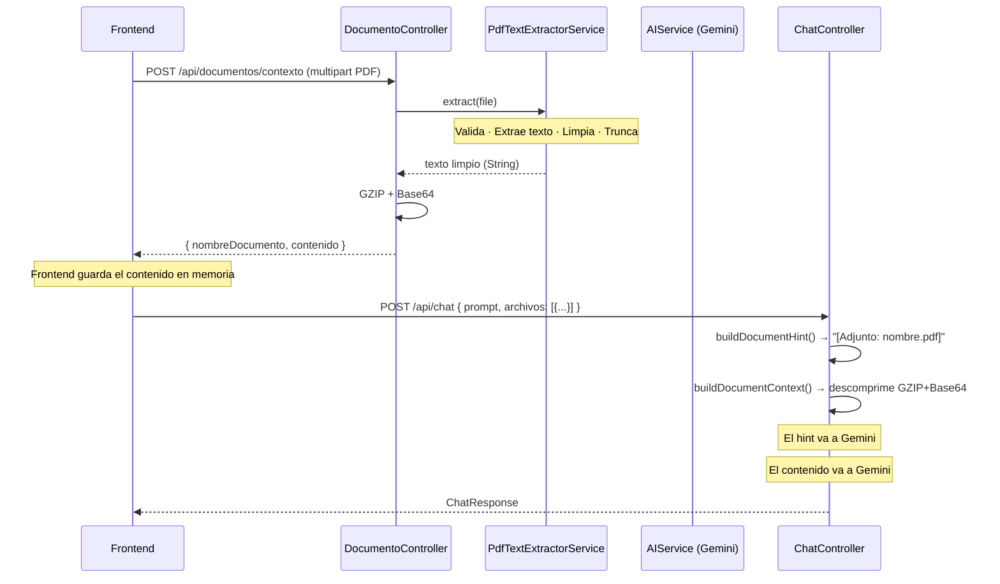
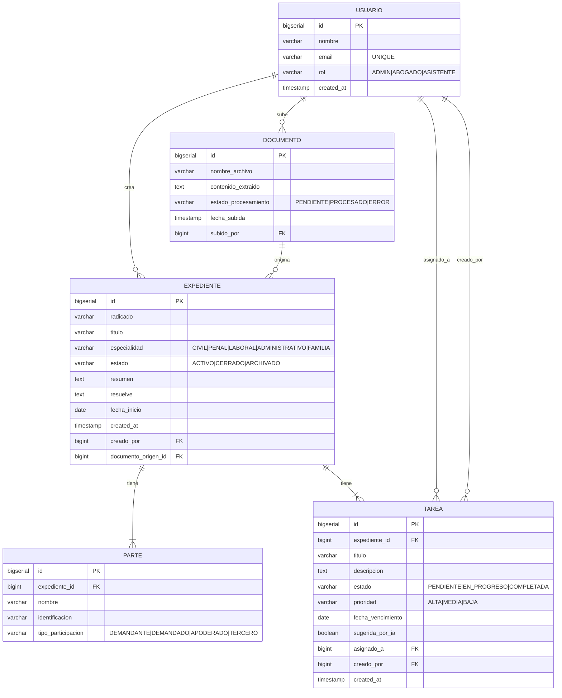

<div align="center">

# ExpedientIA — Backend

**Sistema de gestión de expedientes judiciales colombianos con IA conversacional**

[](https://openjdk.org/projects/jdk/21/)
[](https://spring.io/projects/spring-boot)
[](https://spring.io/projects/spring-ai)
[](https://deepmind.google/technologies/gemini/)
[](https://www.postgresql.org/)
[](https://pdfbox.apache.org/)
[](http://localhost:8080/swagger-ui.html)
[](https://www.docker.com/)


</div>

---

## ¿Qué hace?


ExpedientIA es el backend de un asistente legal colombiano que entiende lenguaje natural. Un abogado escribe "listame los expedientes activos en Bogotá" o "creá el expediente García vs Municipio, proceso civil" y el sistema identifica la intención, ejecuta la acción sobre la base de datos y responde de forma conversacional — sin formularios, sin pantallas adicionales.

El núcleo es un pipeline de dos llamadas a Gemini: la primera clasifica la intención del usuario entre **20 acciones posibles**; el switch en Java ejecuta la acción correspondiente; la segunda llamada genera la respuesta conversacional basada en el resultado real.

> **Buena práctica para el frontend:** enviá siempre el `historial` de la conversación en cada request al chat. El sistema lo usa para mantener contexto entre turnos — sin él, cada mensaje se trata como una conversación nueva. Evitá incluir más de los últimos 10 turnos para no saturar el contexto del modelo.

---

## Stack y dependencias

| Dependencia | Versión | Para qué se usa |
|---|---|---|
| `spring-boot-starter-web` | 3.5.14 | Servidor HTTP, serialización JSON con Jackson, manejo de requests REST |
| `spring-boot-starter-data-jpa` | 3.5.14 | Repositorios, queries automáticas, gestión de transacciones |
| `spring-boot-starter-validation` | 3.5.14 | Validación de request bodies y parámetros con Bean Validation |
| `spring-ai-starter-model-google-genai` | 1.1.6 | Integración con Google Gemini vía `ChatClient` |
| `postgresql` | managed | Driver JDBC para PostgreSQL |
| `pdfbox` | 3.0.3 | Extracción y limpieza de texto desde archivos PDF |
| `springdoc-openapi-starter-webmvc-ui` | 2.8.8 | Generación automática de Swagger UI y especificación OpenAPI 3 |
| `lombok` | managed | Reducción de boilerplate en entidades (`@Data`, `@Builder`) |

### Anotaciones clave del proyecto

**Capa web (`@RestController`):**
```
@RestController          — marca la clase como controlador REST (combina @Controller + @ResponseBody)
@RequestMapping          — define el path base del controller
@PostMapping / @GetMapping / @PutMapping / @DeleteMapping  — métodos HTTP específicos
@PathVariable            — extrae {id} del path
@RequestParam            — extrae ?param=valor de la URL
@RequestBody             — deserializa el JSON del body
@RequestPart             — extrae un campo de un multipart/form-data
@Valid                   — activa la validación del objeto anotado
@RestControllerAdvice    — intercepta excepciones de todos los controllers
@ExceptionHandler        — maneja un tipo específico de excepción
```

**Validaciones (`spring-boot-starter-validation`):**
```
@NotBlank    — campo requerido y no vacío (Strings)
@NotNull     — campo requerido (cualquier tipo)
@Size        — restricción de longitud mínima/máxima
@Email       — formato de email válido
```

**Anotaciones de servicio:**
```
@Service                         — marca el bean como servicio de negocio
@Transactional                   — envuelve el método en una transacción de BD
@Transactional(readOnly = true)  — transacción optimizada para lecturas
```

**Persistencia JPA:**
```
@Entity          — la clase representa una tabla en BD
@Table           — configura nombre de tabla y constraints
@Id              — clave primaria
@GeneratedValue  — estrategia de generación del ID (IDENTITY)
@Column          — configura columna (unique, nullable, length)
@Enumerated      — persiste un enum como String en BD
@OneToMany       — relación uno a muchos (Expediente → Partes, Tareas)
@ManyToOne       — relación muchos a uno (Tarea → Expediente)
```

**OpenAPI / Swagger (`springdoc`):**
```
@Tag             — agrupa endpoints bajo un nombre en Swagger UI
@Operation       — describe un endpoint (summary, description)
@ApiResponse     — documenta un posible código HTTP de respuesta
@Parameter       — describe un parámetro individual
```

### Spring AI — API fluente de `ChatClient`

Spring AI no usa anotaciones para llamar al modelo. Usa una API fluente:

```java
String respuesta = chatClient.prompt()
    .system("Sos un asistente legal colombiano...")  // system prompt
    .user("mensaje del usuario")                      // prompt del usuario
    .call()                                           // ejecuta la llamada a Gemini
    .content();                                       // extrae el texto de la respuesta
```

`ChatClient` se inyecta por constructor (autoconfigured por Spring AI con la `GEMINI_API_KEY` del entorno).

---

## Arquitectura

### Capas del sistema

```
┌──────────────────────────────────────────────────────────────┐
│                      REST Controllers                         │
│    ChatController  ·  ExpedienteController  ·  TareaController│
│    UsuarioController  ·  DocumentoController                  │
└────────────────────────┬─────────────────────────────────────┘
                         │ inyección por constructor
┌────────────────────────▼─────────────────────────────────────┐
│                        Services                               │
│  IntentRouterService  ·  AIService  ·  ChatAnalysisService   │
│  PromptSanitizerService  ·  ExpedienteService                 │
│  TareaService  ·  UsuarioService  ·  DocumentoService         │
│  PdfTextExtractorService  ·  ExtractionNormalizerService      │
└──────────┬──────────────────────────────┬────────────────────┘
           │ Spring Data JPA              │ Spring AI ChatClient
┌──────────▼──────────┐       ┌───────────▼──────────────────┐
│     PostgreSQL      │       │       Google Gemini API       │
│  JPA / Hibernate    │       │    gemini-3.1-flash-lite      │
│  ddl-auto: update   │       │  temp: 0.1 · max: 16384 tok  │
└─────────────────────┘       └──────────────────────────────┘
```

### Las dos llamadas a Gemini

| | Gemini Call #1 | Gemini Call #2 |
|---|---|---|
| **Clase** | `IntentRouterService` | `AIService` · `ChatAnalysisService` |
| **Propósito** | Clasifica intención + extrae parámetros | Extrae datos estructurados o genera respuesta larga |
| **Input** | prompt + historial + hint de archivos adjuntos | Datos de BD + documentos descomprimidos + prompt |
| **Output** | `ChatIntent` record (JSON con acción y parámetros) | JSON estructurado o texto conversacional |
| **Siempre se llama** | Sí (salvo safety net) | Solo en acciones que lo necesitan |

### Flujo de documentos PDF



---

## Modelos de datos

### Diagrama entidad-relación



### Estructura de entidades

```
Expediente
├── radicado         (String, único, null si desconocido)
├── titulo           (String, obligatorio)
├── especialidad     (enum: CIVIL | PENAL | LABORAL | ADMINISTRATIVO | FAMILIA)
├── despacho, ciudad (String)
├── estado           (enum: ACTIVO | CERRADO | ARCHIVADO)
├── resumen          (String)
├── resuelve         (String — parte resolutiva literal, NUNCA se inventa)
├── fechaInicio      (LocalDate)
├── creadoPor    →   Usuario
├── documentoOrigen → Documento
└── partes       →   List<Parte>

Parte
├── nombre, identificacion
└── tipoParticipacion (enum: DEMANDANTE | DEMANDADO | APODERADO | TERCERO)

Tarea
├── titulo, descripcion
├── estado     (enum: PENDIENTE | EN_PROGRESO | COMPLETADA)
├── prioridad  (enum: ALTA | MEDIA | BAJA)
├── fechaVencimiento (LocalDate)
├── sugeridaPorIa (boolean)
├── asignadoA  →  Usuario
└── expediente →  Expediente

Usuario
├── nombre, email (único)
└── rol (enum: ADMIN | ABOGADO | ASISTENTE)

Documento
├── nombre, rutaArchivo, extractoTexto
└── expediente → Expediente
```

---

## API Reference

Base URL: `http://localhost:8080`
Documentación interactiva: [`/swagger-ui.html`](http://localhost:8080/swagger-ui.html)

### Chat IA — `POST /api/chat`

El único endpoint conversacional. Acepta lenguaje natural y detecta la intención automáticamente.

**Query param:** `?usuarioId=1` (opcional — atribuye autoría a recursos creados)

**Request:**
```json
{
  "prompt": "string (obligatorio, 2–3000 chars)",
  "historial": [{ "rol": "user | assistant", "contenido": "string" }],
  "archivos": [{ "nombreDocumento": "string", "contenido": "base64gzip" }]
}
```

**Response — siempre `ChatResponse`:**
```json
{
  "accion": "LISTAR_EXPEDIENTES",
  "mensaje": "Encontré 3 expedientes activos.",
  "datos": [ ],
  "esperaRespuesta": false
}
```

> `esperaRespuesta: true` → el chat necesita que el usuario responda antes de continuar.
> `/api/chat` **siempre retorna `ChatResponse`** — nunca `ProblemDetail`. Los errores del flujo conversacional se manejan internamente.

**Las 20 intenciones:**

| `accion` | Ejemplo de trigger | HTTP | `esperaRespuesta` | `datos` |
|---|---|:---:|:---:|---|
| `ASISTENTE_CREACION` | "creá el expediente García vs Bogotá" | 200→201 | true→false | `CreateExpedienteRequest` parcial → `ExpedienteDTO` |
| `CREAR_EXPEDIENTES_MASIVO` | "creá 3 expedientes: caso 1..." | 201 | false | `Array<ExpedienteDTO>` |
| `LISTAR_EXPEDIENTES` | "listame todos los expedientes" | 200 | false | `Array<ExpedienteDTO>` |
| `OBTENER_EXPEDIENTE` | "mostrame el expediente con radicado X" | 200 | false | `ExpedienteDTO` |
| `BUSCAR_EXPEDIENTES` | "expedientes civiles activos en Bogotá" | 200 | false | `Array<ExpedienteDTO>` |
| `RESUMEN_EXPEDIENTE` | "resumen del expediente 3" | 200 | false | `ExpedienteDTO` |
| `ELIMINAR_EXPEDIENTE` | "eliminá el expediente García" | 200 | true→false | `ExpedienteDTO`→null |
| `LISTAR_TAREAS` | "tareas del expediente García" | 200 | false | `Array<TareaDTO>` |
| `LISTAR_TODAS_TAREAS` | "todas las tareas del sistema" | 200 | false | `Array<TareaDTO>` |
| `SUGERIR_TAREAS` | "sugerí tareas para el expediente 1" | 200 | false | `Array<TareaDTO>` *(IDs temporales, no persistidas)* |
| `CREAR_TAREAS_EXPEDIENTE` | "creá estas tareas para García: ..." | 201 | false | `Array<TareaDTO>` *(persistidas)* |
| `ALERTAS_VENCIMIENTO` | "qué tareas vencen esta semana" | 200 | false | `Array<TareaDTO>` (próx. 7 días) |
| `ELIMINAR_TAREA` | "eliminá la tarea 5" | 200 | true→false | `TareaDTO`→null |
| `CREAR_USUARIO` | "creá el abogado Juan, juan@firma.com" | 201 | false | `UsuarioDTO` |
| `SUGERENCIA_JUDICIAL` | "¿qué excepciones proceden en un ejecutivo?" | 200 | false | null |
| `CONVERSACION_LIBRE` | "ayudame a pensar la estrategia de este caso" | 200 | false | null |
| `ANALISIS_CONTEXTUAL` | "¿cuál expediente es más urgente?" | 200 | false | null |
| `NECESITA_ACLARACION` | mensaje muy corto o ambiguo | 200 | true | null |
| `NO_PERMITIDO` | solicitud fuera del ámbito legal | 200 | false | null |
| `CREAR_EXPEDIENTE` | alias interno de `ASISTENTE_CREACION` | — | — | — |

---

### Expedientes — `/api/expedientes`

| Método | Path | Descripción | Status |
|---|---|---|---|
| `GET` | `/api/expedientes` | Lista todos los expedientes | 200 |
| `GET` | `/api/expedientes/{id}` | Obtiene un expediente por ID | 200, 404 |
| `POST` | `/api/expedientes` | Crea un expediente directo (sin IA) | 201, 400, 409 |
| `PUT` | `/api/expedientes/{id}` | Actualiza un expediente | 200, 404, 409 |
| `DELETE` | `/api/expedientes/{id}` | Elimina expediente y sus tareas en cascada | 204, 404 |

`POST` y `PUT` aceptan `?usuarioId=1` como query param opcional.

---

### Tareas — `/api/tareas`

| Método | Path | Descripción | Params | Status |
|---|---|---|---|---|
| `GET` | `/api/tareas` | Tareas de un expediente | `?expedienteId=1` (req) | 200 |
| `GET` | `/api/tareas/todas` | Todas las tareas del sistema | — | 200 |
| `GET` | `/api/tareas/{id}` | Una tarea por ID | — | 200, 404 |
| `POST` | `/api/tareas` | Crea una tarea | `?usuarioId=1` (opt) | 201 |
| `PUT` | `/api/tareas/{id}` | Actualiza una tarea | — | 200, 404 |
| `DELETE` | `/api/tareas/{id}` | Elimina una tarea | — | 204, 404 |

---

### Usuarios — `/api/usuarios`

| Método | Path | Descripción | Status |
|---|---|---|---|
| `GET` | `/api/usuarios` | Lista todos los usuarios | 200 |
| `GET` | `/api/usuarios/{id}` | Un usuario por ID | 200, 404 |
| `POST` | `/api/usuarios` | Crea un usuario | 201, 400, 409 |
| `PUT` | `/api/usuarios/{id}` | Actualiza un usuario | 200, 404 |
| `DELETE` | `/api/usuarios/{id}` | Elimina un usuario | 204, 404 |

---

### Documentos PDF — `/api/documentos`

| Método | Path | Content-Type | Descripción | Status |
|---|---|---|---|---|
| `POST` | `/api/documentos/contexto` | `multipart/form-data` | Extrae texto de un PDF → GZIP+Base64 para adjuntar al chat | 200 |
| `POST` | `/api/documentos/bulk/analizar` | `multipart/form-data` | Analiza hasta 5 PDFs en paralelo — detecta procesos judiciales con IA | 200, 400 |
| `POST` | `/api/documentos/bulk/confirmar` | `application/json` | Crea en BD los expedientes seleccionados del análisis previo | 201 |

**Flujo bulk:**
```
1. POST /api/documentos/bulk/analizar  →  { procesos: [{ indice: 0, datos: {...} }] }
                                                    ↓  usuario elige cuáles confirmar
2. POST /api/documentos/bulk/confirmar  { seleccionados: [0, 2], procesos: [...] }
                                                    ↓
                                          { totalCreados: 2, expedientes: [...] }
```

---

### Errores — `ProblemDetail` (RFC 7807)

```json
{
  "type": "about:blank",
  "title": "Contenido no permitido detectado",
  "status": 400,
  "detail": "El contenido enviado no está permitido.",
  "instance": "/api/chat",
  "code": "PROMPT_INJECTION"
}
```

| HTTP | `code` | Cuándo |
|:---:|---|---|
| 400 | `PROMPT_INJECTION` | Prompt con patrones de inyección detectados |
| 400 | — | Validación fallida (`@Valid`), JSON malformado |
| 400 | `BULK_LIMIT_EXCEEDED` | Más de 5 archivos en bulk |
| 400 | `PDF_INVALID` | PDF inválido, corrupto o sin texto extraíble |
| 404 | — | Recurso no encontrado |
| 409 | `DUPLICATE_RADICADO` | Radicado ya registrado |
| 409 | `DUPLICATE_EMAIL` | Email ya registrado |
| 413 | `PDF_TOO_LARGE` | PDF mayor a 10 MB |
| 415 | — | Content-Type no soportado |
| 422 | `PDF_SCANNED` | PDF escaneado sin texto seleccionable |
| 500 | — | Error interno inesperado |
| 502 | `AI_EXTRACTION_FAILED` | Gemini no pudo procesar la respuesta |

---

## Diseño de base datos
USUARIO ||--o{ DOCUMENTO : "sube"
    USUARIO ||--o{ EXPEDIENTE : "crea"
    DOCUMENTO ||--o{ EXPEDIENTE : "origina"
    EXPEDIENTE ||--|{ PARTE : "tiene"
    EXPEDIENTE ||--|{ TAREA : "tiene"
    USUARIO ||--o{ TAREA : "asignado_a"
    USUARIO ||--o{ TAREA : "creado_por"

---

## Cómo correrlo

### Con Docker Compose

```bash
git clone https://github.com/tu-org/legalsuite-team-b-hackaton-2026.git
cd legalsuite-team-b-hackaton-2026/expedientia-backend

# Configurar variables de entorno
cp .env.example .env
# Editar .env → agregar GEMINI_API_KEY=tu_clave

docker compose up --build
```

- Backend: `http://localhost:8080`
- Swagger UI: `http://localhost:8080/swagger-ui.html`

### Variables de entorno

| Variable | Descripción | Default |
|---|---|---|
| `GEMINI_API_KEY` | Clave de API de Google Gemini | **obligatoria** |
| `SPRING_DATASOURCE_URL` | URL de conexión PostgreSQL | `jdbc:postgresql://localhost:5432/expedientia` |
| `SPRING_DATASOURCE_USERNAME` | Usuario de BD | `expedientia` |
| `SPRING_DATASOURCE_PASSWORD` | Password de BD | `expedientia` |

### Desarrollo local (sin Docker)

```bash
# Requiere PostgreSQL en localhost:5432 con base de datos "expedientia"
./mvnw spring-boot:run
```

---

## Seguridad de prompts

`PromptSanitizerService` aplica este pipeline antes de cada llamada a Gemini:

1. Rechazo de null bytes y caracteres de control
2. Validación de integridad UTF-8
3. Normalización NFKC (elimina variantes Unicode de caracteres ASCII)
4. Strip de HTML
5. Detección de 21+ patrones de prompt injection (blacklist)
6. Truncado a 3000 caracteres

Un prompt que active cualquiera de estas validaciones retorna `HTTP 400 · PROMPT_INJECTION` antes de llegar al modelo.

---

<div align="center">

Desarrollado para el **Hackathon LegalSuite 2026** — Team B

</div>
